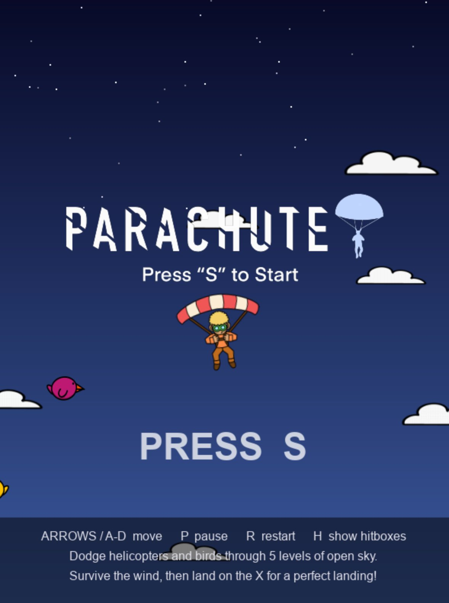
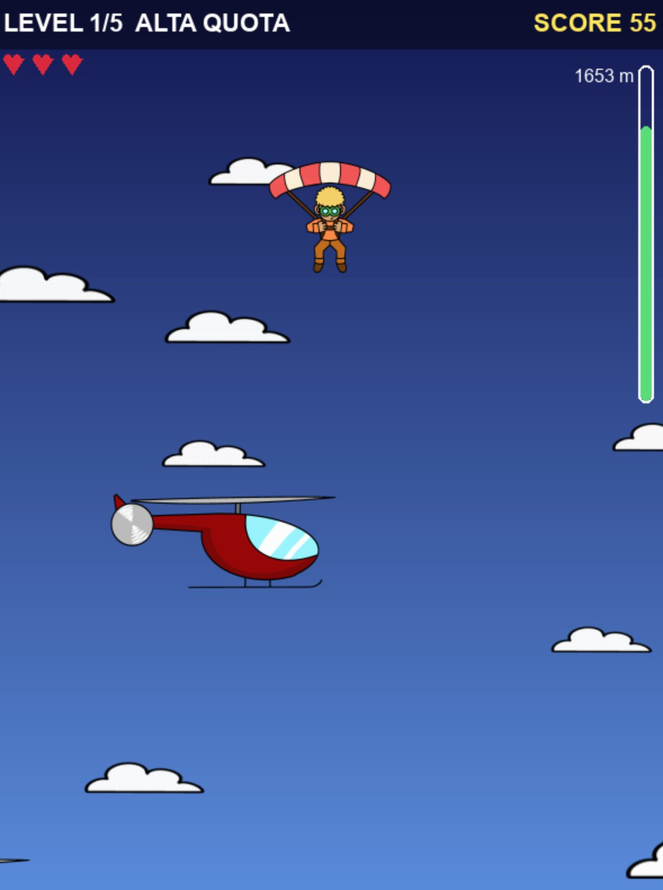
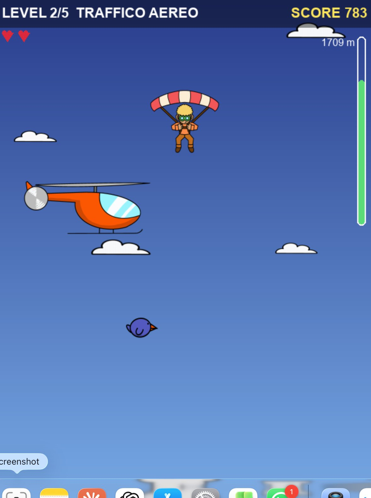
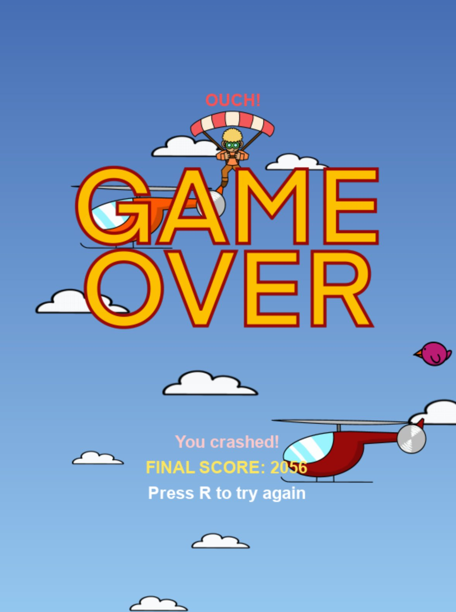

# 🪂 Parachute Deluxe

Parachute Deluxe is a fast-paced 2D arcade game built with Python and Pygame.
You're a skydiver falling through five increasingly chaotic levels of open sky.
Dodge helicopters, lone birds and whole flocks while wind gusts push you off course.
Survive the descent with your three lives and steer onto the island at the very end.
Land on the red X for a perfect-landing bonus and chase your highest score!

## Screenshots

| Main menu | Gameplay |
| --- | --- |
|  |  |
|  |  |

## How to play

| Key | Action |
| --- | --- |
| `S` | Start the game |
| `←` `→` or `A` `D` | Steer left / right |
| `P` | Pause |
| `R` | Restart (after game over / win) |
| `H` | Toggle hitbox view (debug) |
| `Esc` | Quit |

**Scoring:** points for surviving (multiplied by the level), `+25` for near
misses, a bonus for each level cleared, `+150` for landing on the island and
`+500` for hitting the red **X**.

## Installation

```bash
git clone https://github.com/AlessandroDellAcqua/parachute-deluxe.git
cd parachute-deluxe
pip install -r requirements.txt
python Parachute_Deluxe.py
```

Requires Python 3.8+ and Pygame 2.x.

## Project structure

```
parachute-deluxe/
├── Parachute_Deluxe.py   # the whole game
├── media/                # all PNG sprites (player, helicopters, birds, island...)
├── screenshots/          # images shown in this README
├── README.md
├── requirements.txt
└── .gitignore
```

## Features

- 5 hand-tuned levels with random obstacle spawning — every run is different
- Pixel-perfect collisions built from the sprites' transparency (no rectangles!)
- Wind gust system with an on-screen indicator
- Lives, invincibility frames, near-miss bonuses and floating score popups
- Final landing phase: hit the island, aim for the X
- Sky gradient that brightens as you descend, parallax cloud layers
- All gameplay tuning lives in the `LEVELS` list at the top of the file

## Customizing

Open `Parachute_Deluxe.py` and edit the `LEVELS` list: each entry controls a
level's altitude, fall speed, spawn rates, flock chance, wind strength and sky
colors. Add a sixth dict to the list and you have a sixth level.
